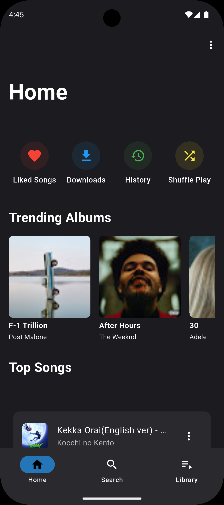
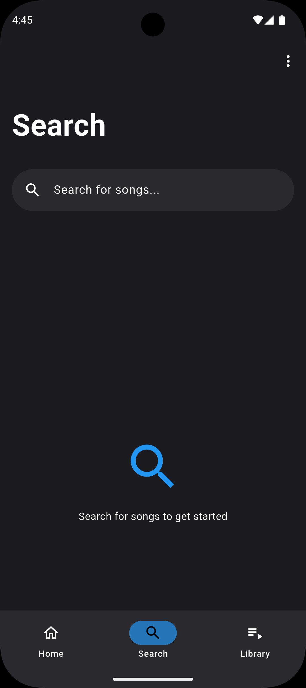
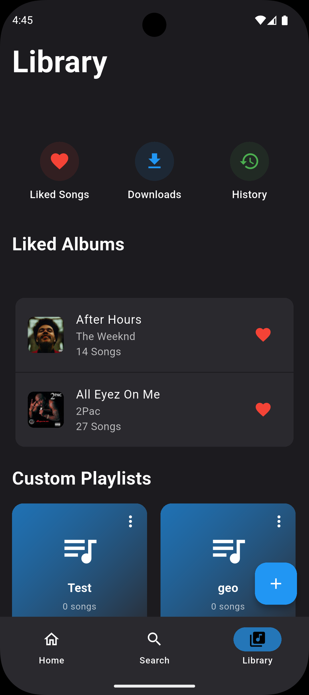
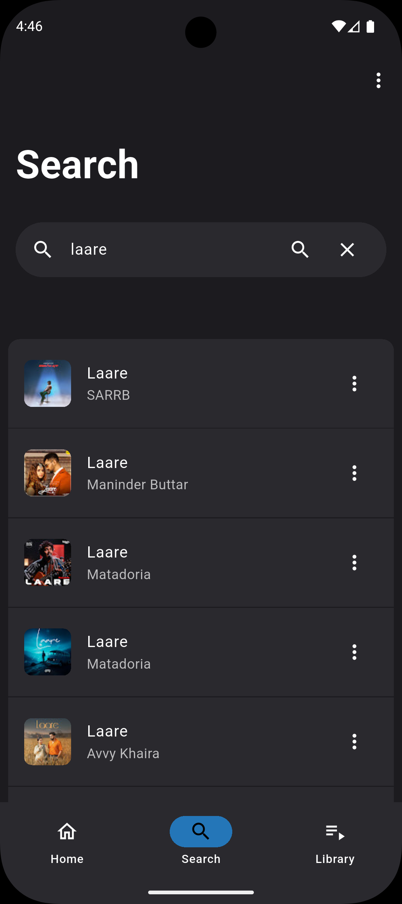
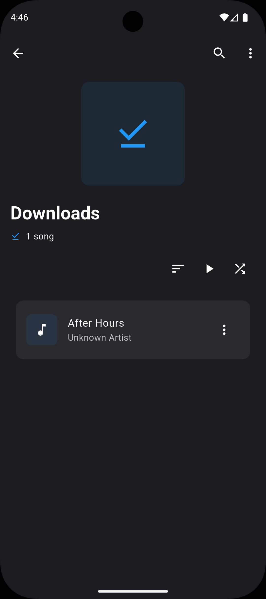
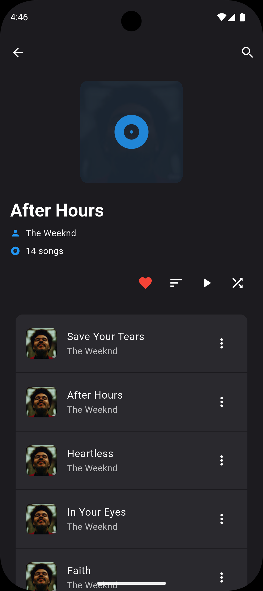
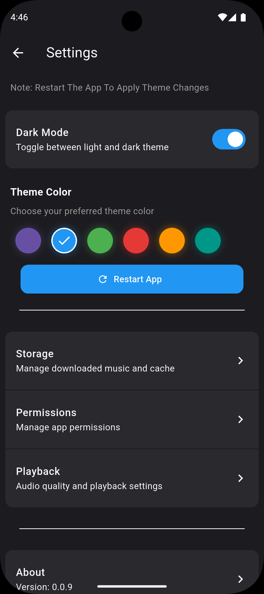

# Nyoom Music 🎵

A modern, feature-rich music player built with Flutter that offers a seamless listening experience with a beautiful Material Design interface.


## Features ✨

- 🎨 Beautiful Material Design UI with customizable themes
- 🌙 Dark/Light mode support
- 🎧 High-quality audio playback
- 💾 Local storage management
- 🎵 Support for various audio formats
- 🔍 Smart search functionality
- 📋 Playlist management
- ⚡ Fast and responsive interface

## Screenshots 📸

<div align="center">
  
  
  
  
  
  
  
</div>

## Getting Started 🚀

### Prerequisites

- Flutter SDK (latest version)
- Android Studio / VS Code
- Git

### Installation

1. Clone the repository:
```bash
git clone https://github.com/AK-4O4/nyoom_music.git
```

2. Navigate to the project directory:
```bash
cd nyoom_music
```

3. Install dependencies:
```bash
flutter pub get
```

4. Run the app:
```bash
flutter run
```

## Usage 📱

1. Launch the app
2. Grant necessary permissions
3. Start enjoying your music!

## Contributing 🤝

Contributions are welcome! Please feel free to submit a Pull Request.

1. Fork the repository
2. Create your feature branch (`git checkout -b feature/AmazingFeature`)
3. Commit your changes (`git commit -m 'Add some AmazingFeature'`)
4. Push to the branch (`git push origin feature/AmazingFeature`)
5. Open a Pull Request

## Acknowledgments 🙏

- Flutter team for the amazing framework
- All contributors who have helped shape this project
- The open-source community for their invaluable resources

---

⭐ Star this repository if you find it helpful!
